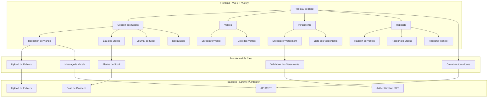
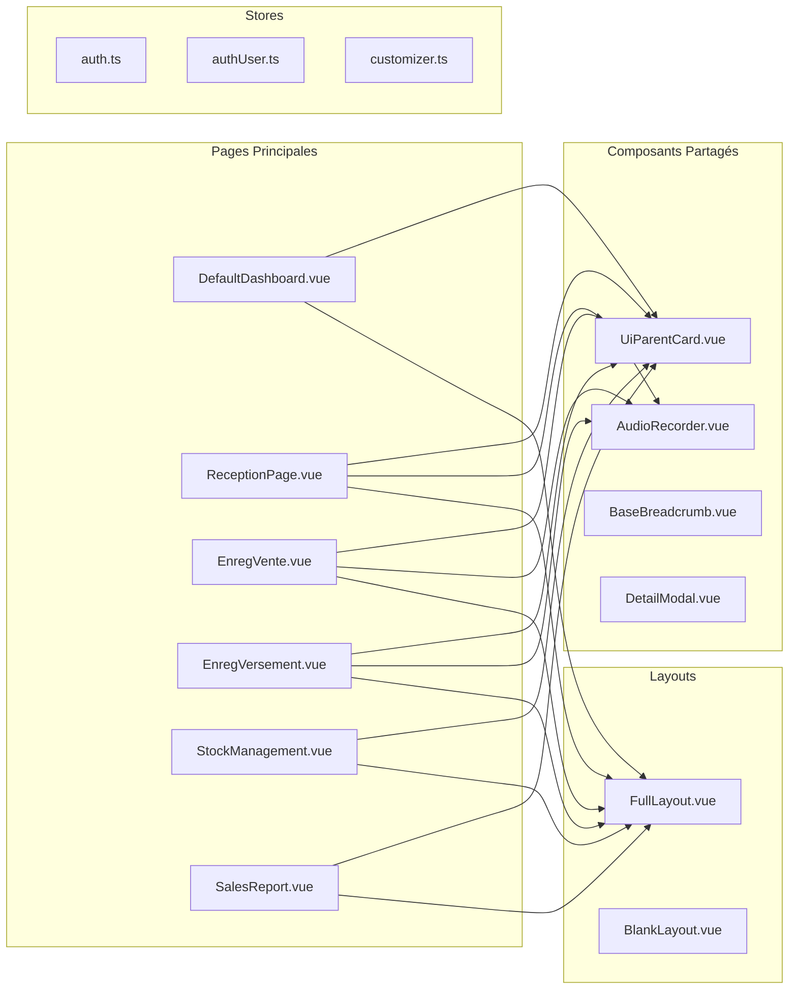
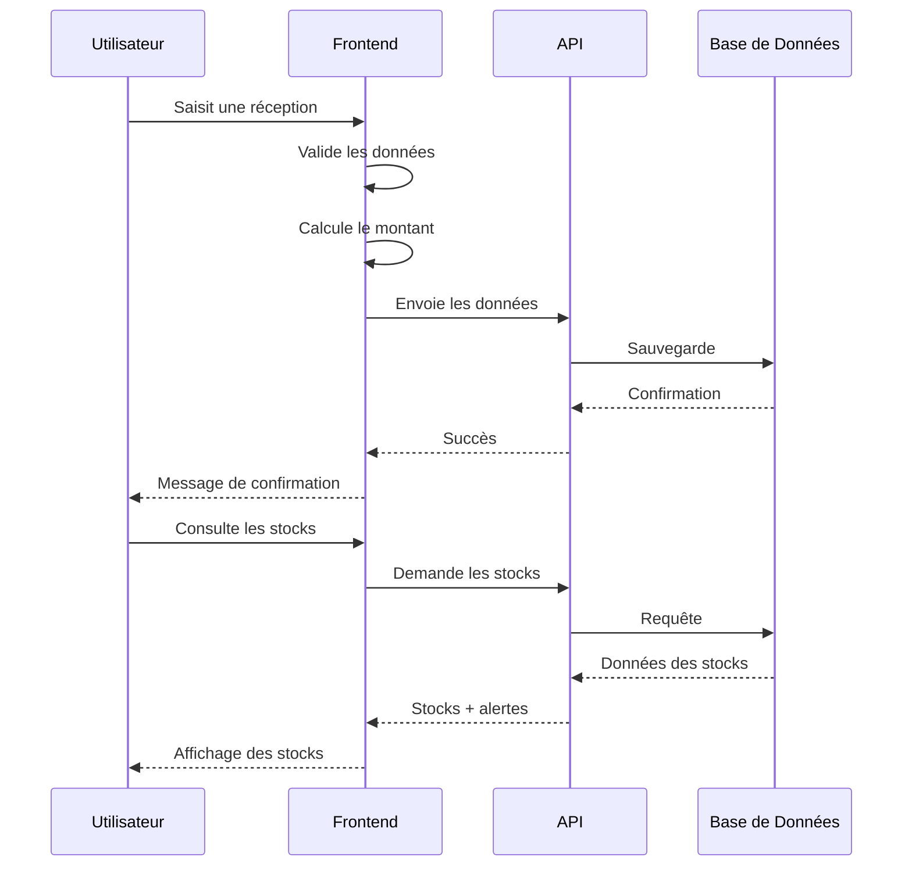

# Architecture de l'Application de Gestion de Boucherie

## Diagramme de l'Architecture

## Structure des Composants

## Flux de Données

## Fonctionnalités par Module

### 📊 Tableau de Bord
- Métriques en temps réel
- Alertes de stock
- Activités récentes
- Actions rapides

### 📦 Gestion des Stocks
- Réception avec photos
- État détaillé des stocks
- Alertes visuelles
- Historique des mouvements

### 💰 Ventes
- Calculs automatiques
- Vérification des stocks
- Quantité restante
- Interface intuitive

### 💳 Versements
- Sélection fournisseur
- Méthodes de paiement
- Upload de reçus
- Statut de validation

### 📈 Rapports
- Filtres avancés
- Statistiques détaillées
- Export PDF/Excel
- Visualisations

## Technologies Utilisées

### Frontend
- **Vue 3** : Framework JavaScript réactif
- **Vuetify 3** : Bibliothèque de composants Material Design
- **TypeScript** : Typage statique
- **Pinia** : Gestion d'état
- **Vue Router** : Navigation
- **Vee-Validate** : Validation des formulaires

### Styling
- **SCSS** : Préprocesseur CSS
- **Responsive Design** : Mobile-first
- **Material Design** : Guidelines Google

### Outils de Développement
- **Vite** : Build tool rapide
- **ESLint** : Linting du code
- **Prettier** : Formatage du code

## Sécurité et Performance

### Sécurité
- Validation côté client et serveur
- Upload sécurisé des fichiers
- Authentification JWT
- Protection CSRF

### Performance
- Lazy loading des composants
- Optimisation des images
- Cache des données
- Code splitting

## Évolutivité

### Architecture Modulaire
- Composants réutilisables
- Séparation des préoccupations
- API RESTful
- Base de données normalisée

### Facilité de Maintenance
- Code documenté
- Tests unitaires
- Logs détaillés
- Monitoring

---

*Cette architecture permet une évolution progressive de l'application tout en maintenant la simplicité d'utilisation pour les bouchers.*
