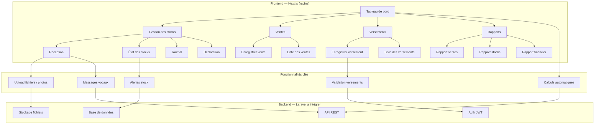
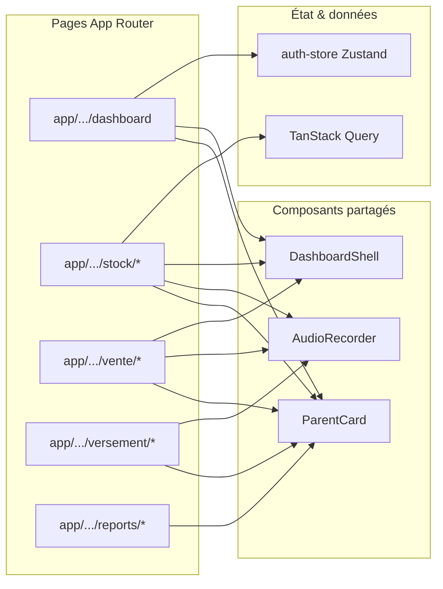
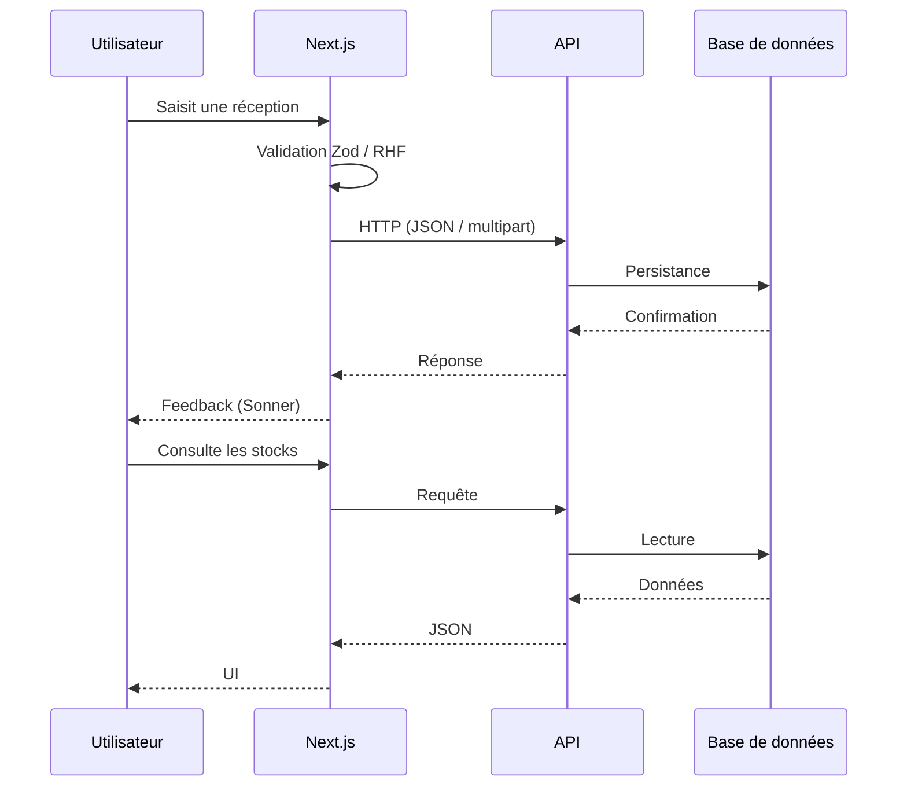

# Architecture — MeatMaster (frontend Next.js)

> **Frontend :** Next.js 16 à la racine du dépôt (App Router, React 19, Tailwind 4, next-intl) + empaquetage mobile **`android/`** (Capacitor, WebView sur `out/`).

## Diagramme d’ensemble

## Structure des composants (Next.js)

## Flux de données (cible)

## Fonctionnalités par module

### Tableau de bord

- Indicateurs et accès rapides
- Activités récentes (mock ou API)

### Stocks

- Réception (évolution prévue : montant total, photos de bordereau)
- État des stocks, journal, déclaration

### Ventes

- Calculs automatiques (quantités × prix)
- Contrôle de stock (règles métier côté API à terme)

### Versements

- Modes de paiement, références
- Workflow validation fournisseur (back-end)

### Rapports

- Filtres par période / type
- Exports PDF/Excel : souvent générés côté serveur

## Technologies (frontend actuel)

| Domaine | Choix |
|--------|--------|
| Framework | Next.js 16, React 19 |
| Langage | TypeScript strict |
| UI | Tailwind CSS 4, Radix UI, composants locaux |
| i18n | next-intl (`/fr`, `/en`) |
| Formulaires | React Hook Form + Zod |
| État client | Zustand (auth persisté) |
| Données serveur | TanStack Query |
| Notifications | Sonner |

### Backend (prévu CdC)

- Laravel, PostgreSQL, fichiers sur stockage sécurisé, JWT.

## Sécurité et performance

- Auth JWT (mock puis API) ; routes protégées côté client (`AuthGuard`)
- HTTPS en production ; chiffrement au repos côté infra
- UI mobile-first, bundles découpés par route App Router

## Évolutivité

- Modules par fonctionnalité sous `src/app/[locale]/(main)/...`
- Client HTTP et schémas dans `src/lib/`
- Intégration progressive avec l’API Laravel sans casser les mocks de développement

---

*Document aligné sur le frontend Next.js ; mise à jour lors du branchement complet sur l’API.*
